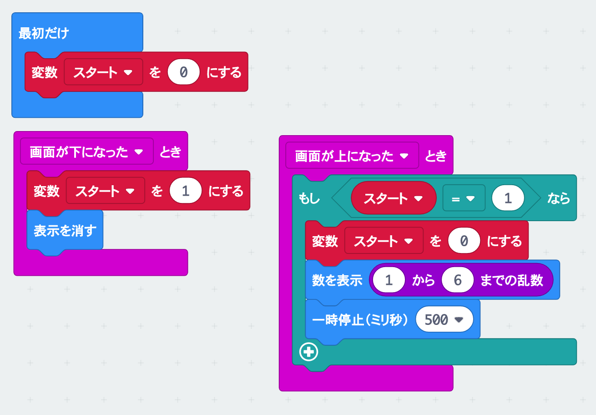
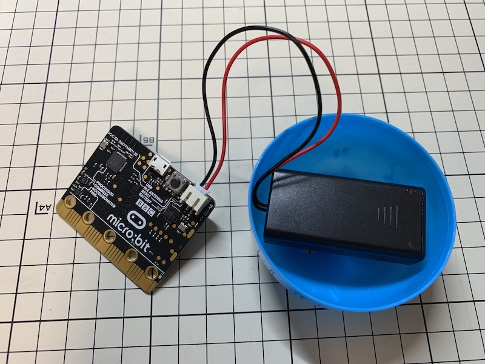
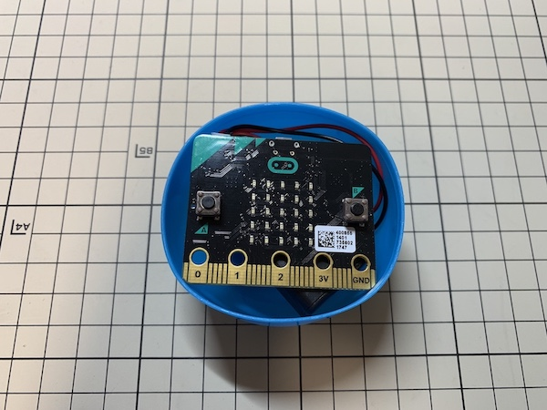
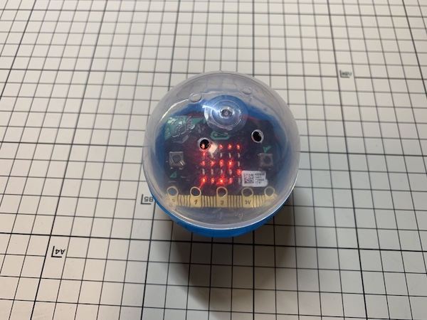

# サイコロを作ろう

## むずかしさ　★☆☆☆☆

## 使うもの
1. マイクロビット本体
2. 電池ボックス
3. ガチャガチャのカプセル

## プログラム

* 変数「スタート」を作るよ
* 紫色の乱数ブロックは「計算」メニューにあるよ

プロジェクト： https://makecode.microbit.org/_eyYKLefCTY0w

## 作り方

1. プログラムをマイクロビットに書き込む
2. 電池ボックスと繋ぐ
3. LEDが外から見えるようにカプセルに入れる

## 使い方

* 転がして止まると1〜6の数字がでるよ

